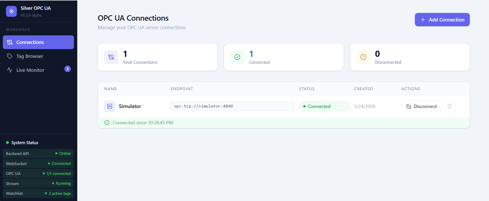
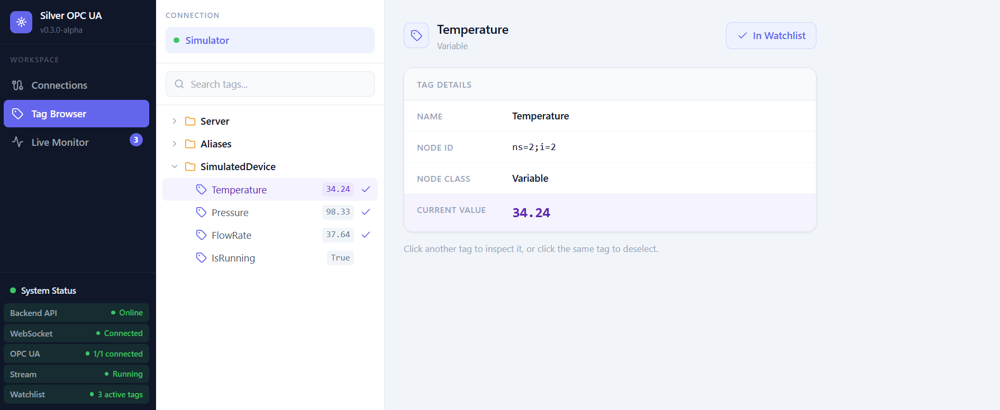
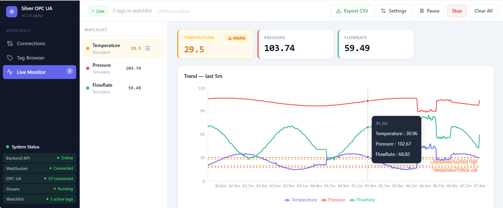

# Silver OPC UA Toolkit

Modern open-source OPC UA toolkit for industrial monitoring, realtime visualization, and future industrial AI workflows.

Built for industrial engineers, automation developers, and Industry 4.0 environments.

---

## Overview

Silver OPC UA Toolkit is a modern industrial software platform focused on creating lightweight, developer-friendly, and cross-platform industrial tools around OPC UA.

The project aims to modernize industrial monitoring workflows with clean UI, realtime data handling, scalable OPC UA navigation, and future AI-assisted industrial tooling.

Designed for:

- Industrial engineers
- Automation developers
- PLC programmers
- System integrators
- IIoT developers
- Smart factory environments

---

## Why Silver OPC UA Toolkit?

Most industrial software tools are:

- Outdated
- Windows-only
- Difficult to use
- Built around legacy UX patterns
- Poor at realtime workflows

Silver OPC UA Toolkit aims to provide a modern alternative with:

- Modern web-based UI
- Realtime industrial workflows
- Cross-platform architecture
- Lightweight deployment
- Open-source flexibility
- Future-ready AI integration

---

## Current Features

### Implemented

- OPC UA Connection Manager
- Scalable Tag Browser
- Searchable OPC UA Navigation
- Watchlist-based monitoring workflow (persistent via localStorage)
- Realtime OPC UA Monitoring
- WebSocket-based realtime updates
- Realtime Charts
- Configurable monitoring windows
- Configurable update intervals
- Chart pause / resume
- Boolean tag visualization (ON/OFF)
- CSV data export with time-window selection
- Alarm and threshold visualization (Warning / Critical, High / Low)
- Threshold reference lines on trend charts
- System Status panel with live runtime indicators
- Realistic 5-mode industrial simulator (normal / alarm / step / frozen / recovering)
- Structured logging
- Dockerized deployment
- Modern sidebar navigation with industrial SaaS aesthetic

---

## Architecture Overview

```text
OPC UA Server
      ↓
asyncua Client Layer
      ↓
FastAPI Backend
      ↓
REST API + WebSockets
      ↓
React Frontend
```

---

## Tech Stack

### Backend

- Python 3.12
- FastAPI
- asyncua
- SQLAlchemy (async)
- WebSockets
- Pydantic
- uv

### Frontend

- React 19
- TypeScript
- Tailwind CSS
- shadcn/ui
- Recharts
- Vite

### Infrastructure

- Docker
- docker-compose
- nginx

---

# Quick Start

## Requirements

- Python 3.12+
- Node.js 20+
- uv (`pip install uv`)
- Docker (optional)

---

## Clone Repository

```bash
git clone https://github.com/silverlabs-dev/Silver-OPCUA-Toolkit.git
cd Silver-OPCUA-Toolkit
```

---

# Development Setup

## Terminal 1 — OPC UA Simulator

```bash
cd backend
uv run python simulator/server.py
```

Simulator endpoint:

```text
opc.tcp://localhost:4840
```

---

## Terminal 2 — Backend

```bash
cd backend
uv sync
uv run python run.py
```

Backend API docs:

```text
http://localhost:8000/docs
```

---

## Terminal 3 — Frontend

```bash
cd frontend
npm install
npm run dev
```

Frontend development server:

```text
http://localhost:5173
```

---

# Docker Quick Start

Run the full stack with:

```bash
docker compose up --build
```

Services:

| Service | URL |
|---|---|
| Frontend | http://localhost:8080 |
| Backend API | http://localhost:8000/docs |
| OPC UA Simulator | opc.tcp://localhost:4840 |

Inside Docker containers, use:

```text
opc.tcp://simulator:4840
```

---

# Screenshots

## Connections Management

Modern OPC UA connection management with realtime status tracking, retry monitoring, and connection lifecycle visibility.

## Tag Browser

Scalable industrial tag browser with search, hierarchical OPC UA navigation, and watchlist workflow.

## Live Monitoring

Realtime industrial monitoring dashboard with watchlists, configurable update rates, and live trend visualization.

---

# Roadmap

## Near-Term

- ✅ Persistent watchlists
- ✅ CSV export
- ✅ Alarm visualization
- ✅ System Status panel
- ✅ Improved industrial UX workflows
- OPC UA security foundations (v0.4.0-alpha)
- Multi-connection monitoring (v0.5.0-beta)

## Mid-Term

- Historical data logging
- MQTT integration
- Alarm & event workflows
- Multi-device support
- OPC UA write support

## Long-Term

- AI-assisted diagnostics
- Predictive maintenance
- Industrial AI copilot
- Edge AI workflows
- Cloud monitoring platform

---

# Project Status

Current status: **v0.3.0-alpha**

The project is under active development and currently focused on building a modern industrial monitoring platform around OPC UA and future industrial AI workflows.

Current alpha focus areas:

- Realtime industrial monitoring
- Modern industrial UX
- Scalable OPC UA workflows
- Alarm and threshold visualization
- Lightweight deployment
- Open-source industrial tooling

---

# Contributing

Contributions, feedback, architecture discussions, and industrial workflow ideas are welcome.

Contribution guidelines and issue templates will be added in upcoming releases.

---


# License

Licensed under the Apache License 2.0.